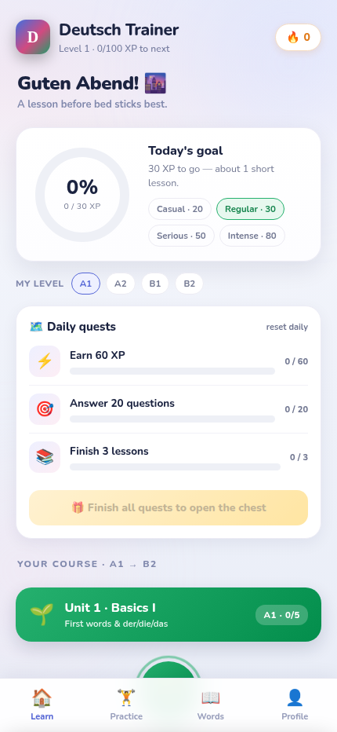
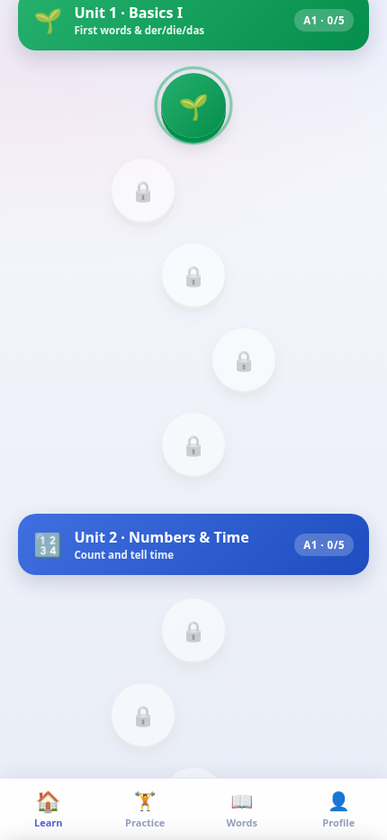
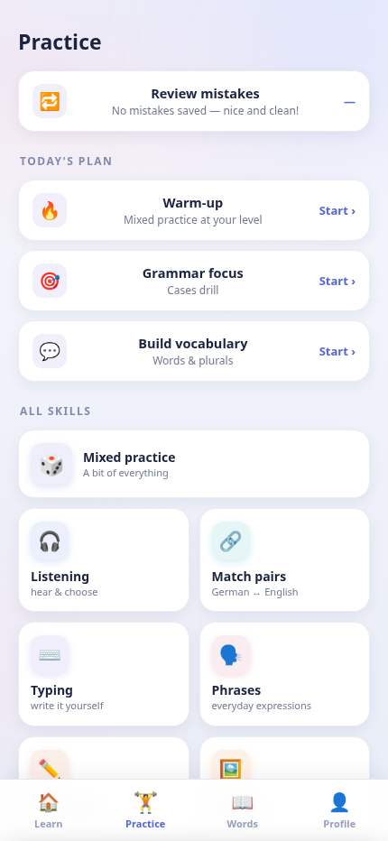
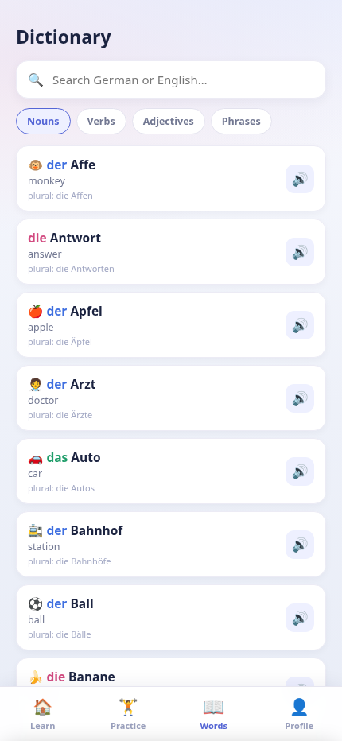
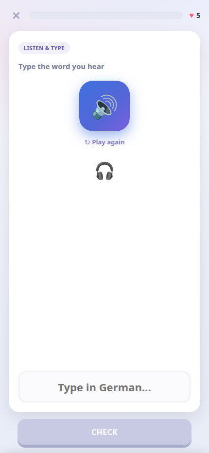
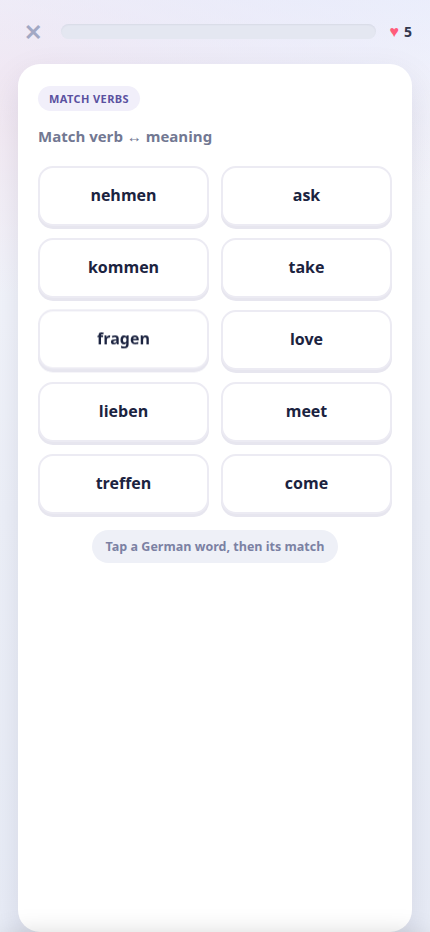
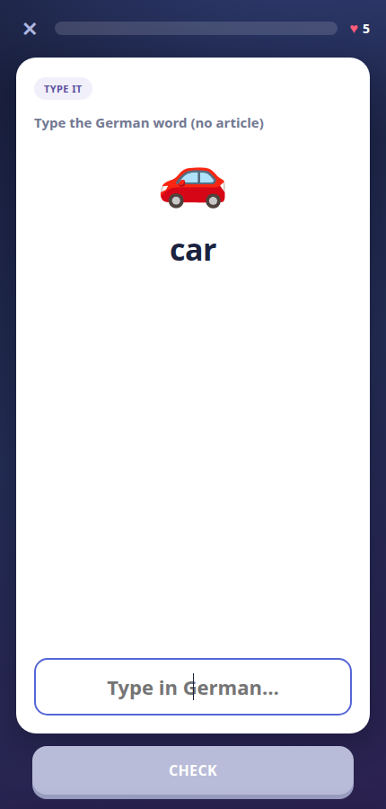
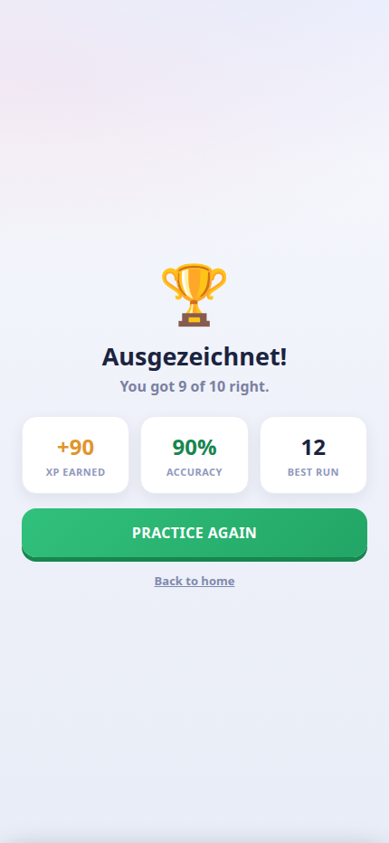

<div align="center">


# Deutsch Trainer

**A beautiful, offline-first German trainer — from A1 to B2.**
Grammar, vocabulary, listening and more, in a fast Duolingo-style app that installs to your home screen. No account, no ads, no tracking.

[](https://bluerrror.github.io/deutsch-trainer/)
&nbsp;


</div>

---

## ✨ Features

- **🗺️ Structured course (A1 → B2)** — 12 themed units × 5 lessons on a Duolingo-style path with locks, star ratings and a boss lesson per unit.
- **📊 Pick your level** — choose A1–B2 and every practice session adapts its question mix.
- **🔁 Mistake review** — wrong answers are saved automatically and replayed until you clear them.
- **🎯 No repeats** — the question engine remembers what it asked and always serves fresh questions.
- **🗓️ Daily quests & chest** — three rotating goals per day with a bonus-XP reward chest.
- **📖 Built-in dictionary** — searchable word bank (nouns with articles & plurals, verbs with past forms, adjectives, phrases), each with audio.
- **🎧 Listening** — hear real German (your device's voices): tap what you hear, type it, or rebuild the sentence from tiles.
- **🔊 Read-aloud & voices** — questions, words and sentences are read to you in German; mute anytime from the lesson bar, and pick between 4 voices (2 female, 2 male) in Settings.
- **🔗 Match pairs, ⌨️ typing, 🧩 sentence builder, 🖼️ pictures, ✅ true/false** — many distinct exercise types.
- **📘 Full grammar coverage** — articles, all four cases, adjective endings, prepositions (incl. two-way), verb + case, present tense, modal verbs, Perfekt, Präteritum, separable verbs, Konjunktiv II, plurals, numbers.
- **🎮 Game feel** — XP, hearts, daily goal ring, streaks, combos, sound effects, haptics, confetti and an achievements wall.
- **⚙️ Settings** — toggle sound and speech; reset progress anytime.
- **💾 Private & offline** — progress saves on your device only; after the first load it runs with no internet.

## 📱 Screenshots

<div align="center">

&nbsp;

&nbsp;

&nbsp;

&nbsp;

&nbsp;

&nbsp;

&nbsp;

</div>

## 🚀 Install on your iPhone (≈2 minutes)

1. Open **Safari** on your iPhone and go to **[bluerrror.github.io/deutsch-trainer](https://bluerrror.github.io/deutsch-trainer/)**.
2. Wait a few seconds so it caches for offline use.
3. Tap the **Share** button (□↑) → **Add to Home Screen** → **Add**.

You'll get a **"D" icon** on your home screen that opens **fullscreen** and **works offline**. On Android/Chrome, use the **⋮ menu → Install app**.

## 🧠 Question types

| Type | What you do |
| --- | --- |
| Multiple choice | Pick the correct article, case, ending, form… |
| Listening | Hear German, choose the word/meaning |
| Type it | Write the German word from an image or prompt |
| Listen & type | Hear a word and type it |
| Match pairs | Match German words to their English meaning |
| Sentence build | Order word tiles into a correct sentence |
| True / false | Judge whether a translation is right |
| Picture | Match an image to the right word |

## 🛠️ Tech

- A **single `index.html`** — vanilla HTML, CSS and JavaScript. **Zero dependencies, no build step.**
- Installable **PWA**: [`manifest.webmanifest`](manifest.webmanifest) + a service worker ([`sw.js`](sw.js)) for offline caching.
- **Web Speech API** for pronunciation, **Web Audio API** for sound effects, `navigator.vibrate` for haptics.
- Hosted free on **GitHub Pages**.

## 💻 Run locally

```bash
git clone https://github.com/Bluerrror/deutsch-trainer.git
cd deutsch-trainer
python3 -m http.server 8000      # then open http://localhost:8000
```

> Open via a local server (not `file://`) so the service worker and manifest load correctly.

## 📄 License

Released under the [MIT License](LICENSE).

<div align="center">
<sub>Made with ❤️ for German learners · <a href="https://bluerrror.github.io/deutsch-trainer/">Open the app →</a></sub>
</div>
